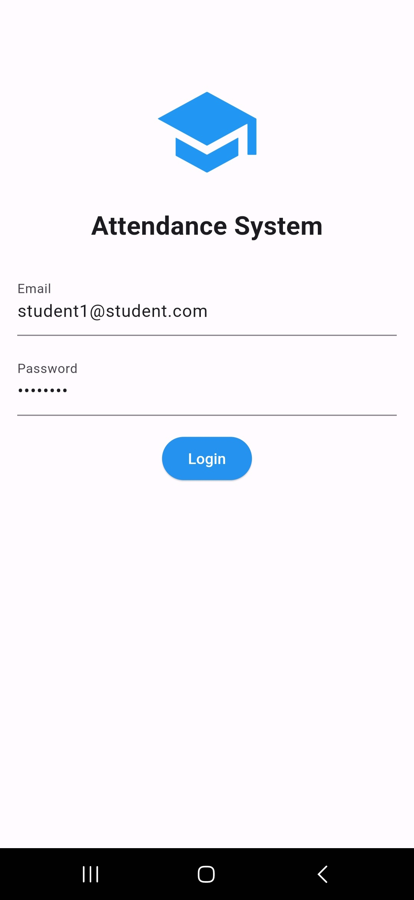
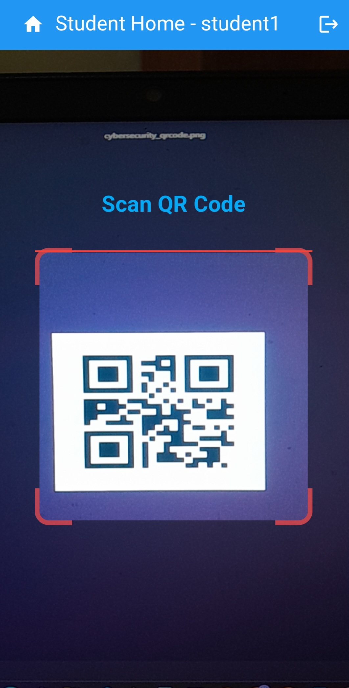
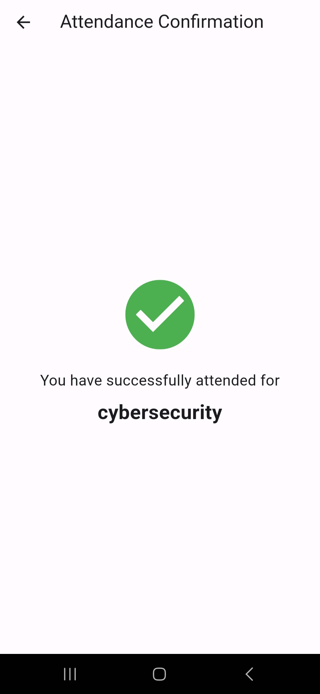
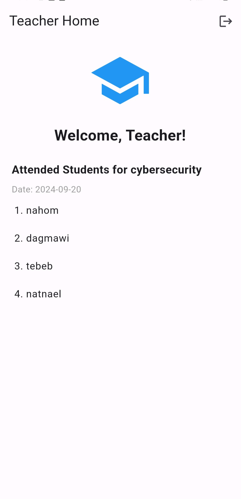

## Description

The Attendance System is a mobile application developed using **Flutter** and **Firebase** that simplifies attendance management in educational institutions. Users can log in with their registered email addresses through Firebase Authentication and are redirected to specific pages based on their roles—students or teachers.

### Key Features

- **User Authentication:** Secure login using registered email addresses via Firebase Authentication.
- **Role-Based Access:** Students and teachers have different interfaces tailored to their needs.
- **QR Code Scanning:** Students can easily mark their attendance by scanning QR codes associated with their classes. This feature ensures a quick, secure, and efficient way to record attendance.
- **Attendance Tracking for Teachers:** Teachers can view a comprehensive list of students who have attended their classes, making it easier to manage attendance records.


Here are some screenshots of the application showcasing its UI and key functionality:

<table>
  <tr>
    <td></td>
    <td></td>
  </tr>
  <tr>
    <td></td>
    <td></td>
  </tr>
</table>


## Installation

### Prerequisites

- [Flutter](https://flutter.dev/docs/get-started/install) installed on your machine.
- A Firebase project set up for authentication and database.

### Steps

1. **Clone the repository:**
   ```bash
   git clone https://github.com/username/repository.git
